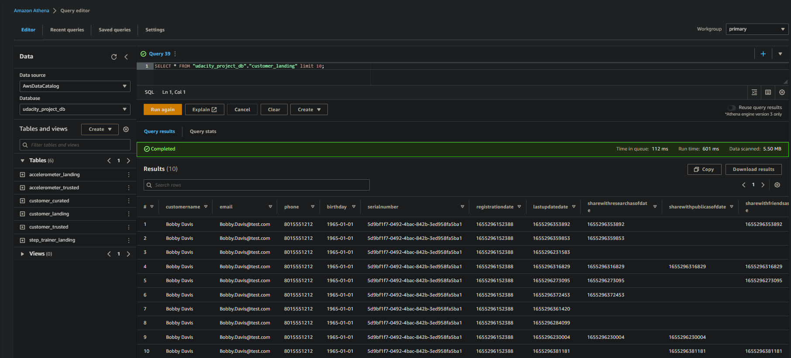
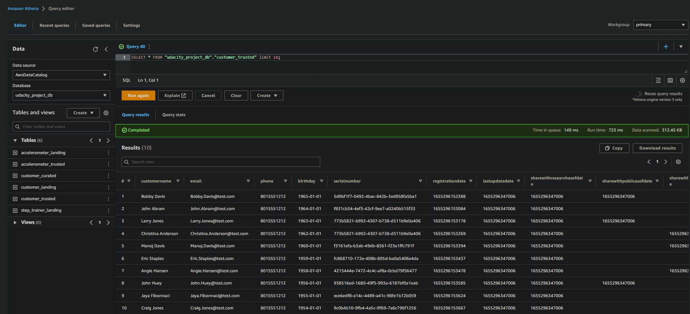
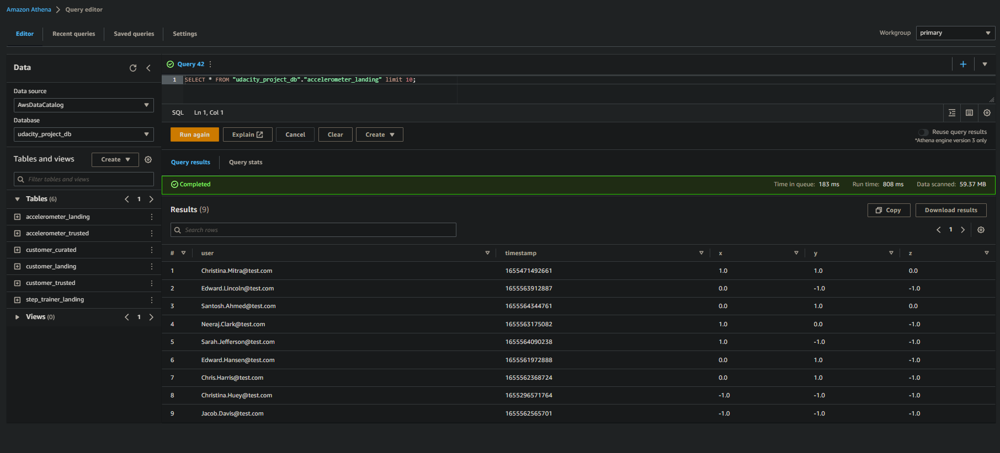
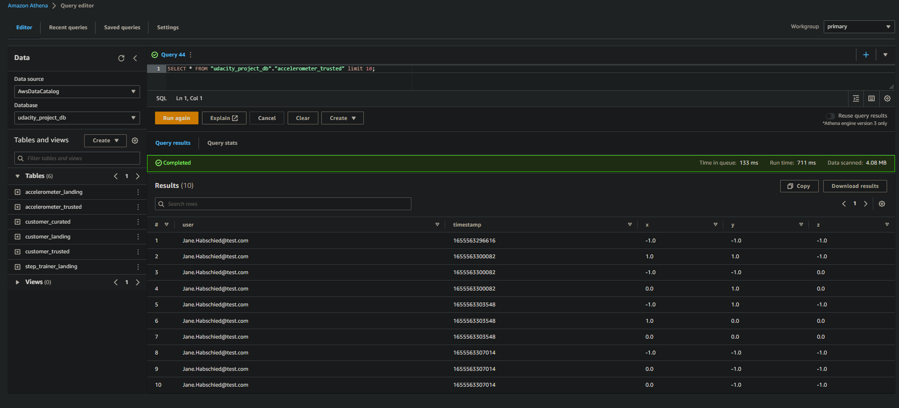
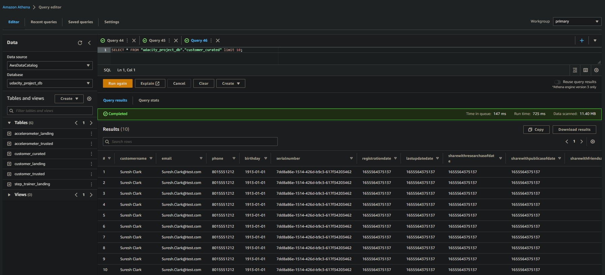

# A. Project Instructions

In this project, using ``AWS Glue, AWS S3, Python, and Spark``, we are going to create or generate Python scripts to build a **machine learning** table that satisfies these requirements from the **STEDI** data scientists.

The STEDI team wants to use the motion sensor data to train a machine learning model to detect steps accurately in real-time. Privacy will be a primary consideration in deciding what data can be used.

Some of the early adopters have agreed to share their data for research purposes. Only these customers’ Step Trainer and accelerometer data should be used in the training data for the machine learning model.

As a data engineer on the STEDI Step Trainer team, I will extract the data produced by the STEDI Step Trainer sensors and the mobile app, and curate them into a data lakehouse solution on AWS so that Data Scientists can train the learning model by creating 05 AWS Glue Jobs.

# B. Files and Screenshots
## B.1 Customer landing and trusted
Here, we will create a Python script that sanitize the Customer data from the Website (Landing Zone) and only store the Customer Records who agreed to share their data for research purposes (Trusted Zone) - creating a Glue Table called ``customer_trusted``.

* [customer_landing.sql](./Scrpits/01-customer_landing.sql)

    

 

  <caption>Customer Landing</caption>  

 

* [customer_trusted.sql](./Scrpits/01-customer_trusted.sql)

    

 

  <caption>Customer Trusted</caption>  

 

## B.2 Accelerometer landing and trusted
Here, we will create a Python script that sanitize the Accelerometer data from the Mobile App (Landing Zone) and only store Accelerometer readings from the customer who agreed to share their data for research purposes (Trusted Zone) - creating a Glue Table called ``accelerometer_trusted``.

* [accelerometer_landing.sql](./Scrpits/02-accelerometer_landing.sql)

    

 

  <caption>Accelerometer Landing</caption>  

 

* [accelerometer_trusted.sql](./Scrpits/02-accelerometer_trusted.sql)

    

 

  <caption>Accelerometer Trusted</caption>  

 

## B.3 Customer curated.
Here, we will create a Python script that sanitize the Customer data (trusted Zone)from the Website (Landing Zone) and creates a Glue table (Curated Zone) that only includes customers who have acceloerometer data and have agreed to share their data for research called ``customers_curated``.

* [customer_landing.sql](./Scrpits/03-customer_curated.sql)

    

 

  <caption>Customer Curated</caption>  

 

## B.4 Step trainer trusted.
Here, we will create a Python script that reads Trainer IoT data stream (S3) and pipulates a Trusted Zone Glue Table called ``step_trainer_trusted`` containing thee Step Trainer Records data for customers who have agreed to share their data and populates a glue table called ``machine_learning_curated``

* [step_trainer_trusted.py](./Scrpits/04-step_trainer_trusted.py)

## B.5 Machine learning curated
Finally, we will create a Python script that creates an aggregated table that has each of the Step Trainer readings, and the associated accelerometer reading data for the same timestamp, but only for customers who have agreed to share their data for research called ``customers_curated``.

* [machine_learning_curated](./Scrpits/05-machine_learning_curated.py)

