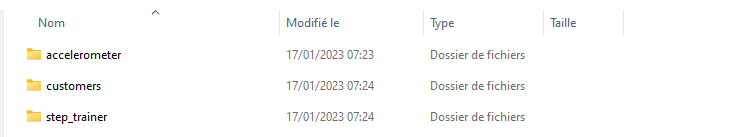

# A - Download data
To accomplish this project, you have to set up an environment.
1. You can [download the data from here](https://video.udacity-data.com/topher/2022/June/62be2ed5_stedihumanbalanceanalyticsdata/stedihumanbalanceanalyticsdata.zip)

2. Extract it from their respective location.

<p align="center">
    
</p> 
<p align="center">
  <caption>File's folder</caption>  
</p> 

3. Create a bucket in your AWS account, lets call it ``YOUR_BUCKET``.
   
4. Now you need to synchronize bucket create in the previous step. From the location where you've extracted files, execute those three commands:

````sh
aws s3 sync ./customers/     s3://YOUR_BUCKET/customer/landing
aws s3 sync ./accelerometer/ s3://YOUR_BUCKET/accelerometer/landing
aws s3 sync ./step_trainer/  s3://YOUR_BUCKET/step_trainer/landing
````
# B. Datasets
**Customer** Records (from fulfillment and the STEDI website):

[Data Download URL](https://github.com/udacity/nd027-Data-Engineering-Data-Lakes-AWS-Exercises/tree/main/project/starter/customer)

``AWS S3 Bucket URI - s3://cd0030bucket/customers/``

**Customer** dataset ontains the following fields:

* serialnumber
* sharewithpublicasofdate
* birthday
* registrationdate
* sharewithresearchasofdate
* customername
* e*mail
* lastupdatedate
* phone
* sharewithfriendsasofdate
  
**Step Trainer** Records (data from the motion sensor):

[Data Download URL](https://github.com/udacity/nd027-Data-Engineering-Data-Lakes-AWS-Exercises/tree/main/project/starter/step_trainer)

``AWS S3 Bucket URI - s3://cd0030bucket/step_trainer/``

**Step Trainer** dataset contains the following fields:

* sensorReadingTime
* serialNumber
* distanceFromObject
  
**Accelerometer** Records (from the mobile app):

[Data Download URL](https://github.com/udacity/nd027-Data-Engineering-Data-Lakes-AWS-Exercises/tree/main/project/starter/accelerometer)

``AWS S3 Bucket URI - s3://cd0030bucket/accelerometer/``

**Accelerometer** contains the following fields:

* timeStamp
* user
* x
* y
* z
# C. Requirements
To simulate the data coming from the various sources, you will need to create your own S3 directories for customer_landing, step_trainer_landing, and accelerometer_landing zones, and copy the data there as a starting point.

1. We have decided you want to get a feel for the data you are dealing with in a semi-structured format, so we've decided to create two Glue tables for the two landing zones. We will share your ``customer_landing.sql`` and our ``accelerometer_landing.sql`` script in git.

2. Query those tables using Athena, and take a screenshot of each one showing the resulting data. Name the screenshots ``customer_landing(.png,.jpeg, etc.)`` and ``accelerometer_landing(.png,.jpeg, etc.)``.
