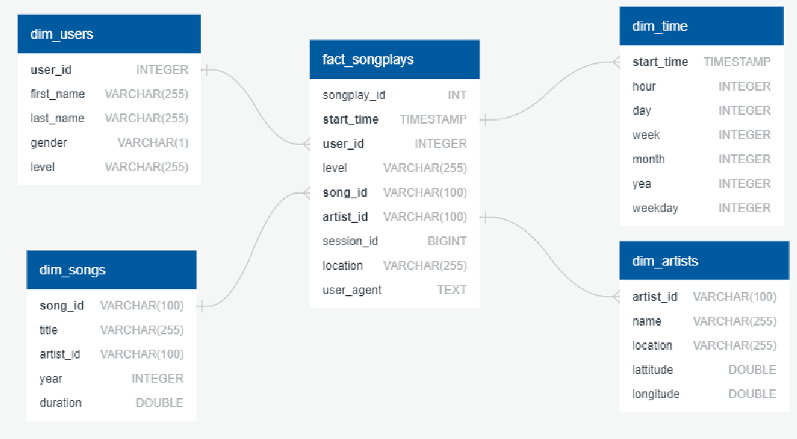
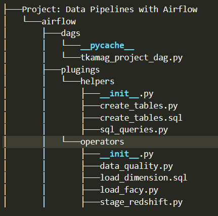
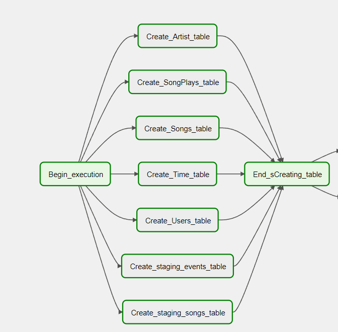
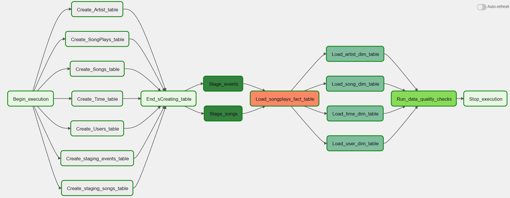

# Project: Data Pipelines with Airflow

## Introduction 
``Sparkify``, a music streaming startup, has grown their user base and song database and want to move their processes and data onto the cloud. Their data resides in S3, in a directory of JSON logs on user activity on the app, as well as a directory with JSON metadata on the songs in their app.

## Assignation

As a data engineer, our assignment is to build an ``ETL pipeline`` that extracts data from their current location (here ``S3``), stages them in ``Redshift``, and transforms data into a set of dimensional tables for their analytics team to continue finding insights in what songs their users are listening to. We'll be able to test your database and ``ETL pipeline`` by running queries given to you by the analytics team from ``Sparkify`` and compare your results with their expected results.

``Sparkify`` data are a collection of information stored in an organized manner for easy retrieval and use. These data are store into tables  and related to each other. ``Relational databases`` are tools for storing various types of information that are related to each other in some way. 

 Data engineers build and design relational databases to assist organizations in collecting, storing, and analyzing data. Then, data analysts and data scientists use them for digesting large amounts of data and identifying meaningful insights. You can learn more about relational database features, use cases, and know much mùore about users preferences. For example, what is the most played song? When is the highest usage time of day by hour for songs?etc ...

## Schema for Song Play Analysis
 Using the song and event datasets, we've created a **star schema** optimized for queries on song play analysis. 
 The purpose of a **star schemas** is to denormalize the data, which means adding redundant columns to dimension tables to make querying and working with the data faster and easier. The goal is to trade some redundancy (duplication of data) in the data model for increased query speed, by avoiding computationally expensive join operations.

The overall schema can be resume below:

    

 

## Project Overview
As a data engineer, this project will introduce us to the core concepts of Apache Airflow. To complete the project, **we will need to create our own custom operators** to perform tasks such as **staging the data**, **filling the data warehouse**, and **running checks** on the data as the final step.

We have been provided with a project template that takes care of all the imports and provides four empty operators that need to be implemented into functional pieces of a data pipeline. The template also contains a set of tasks that need to be linked to achieve a coherent and sensible data flow within the pipeline.

At the end, the following DAG was choosen:

    

 

## File's structure

    

 

* **Project: Data Pipelines with Airflow** is the main directory of our project witch contains sub-folders like:

* **airflow** is the repository using by Airflow UI to centralize all Dag's.

* Inside airflow repository, we have two others folders/
    * **dags**, where all DAG are centralize. For our purpose we only have one dag **tkamag_project_dag.py**. 
    * **Helpers** folders containings:
        * **Plugins** containing all additionnals tools using in our project.
            * **create_tables.py**: Python script for creating all tables.
            * **create_tables.py**: SQL script for creating tables.
            * **sql_queries**: Python class containing SqlQueries.
        * **Operators** containing somes classes
            * **data_quality.py**
            * **load_dimension.py**
            * **Load_fact.py**
            * **stage_redshift.py**

## Creating the DAG
As mentionned, the dag located in the **dag's folder**. you just need to execute the dasg file with all his dependencies.

In order to completely create the project, we've added an initial table creation block.

This initial block consist of creating all table.

    

 

Now our final projet look like:

    

